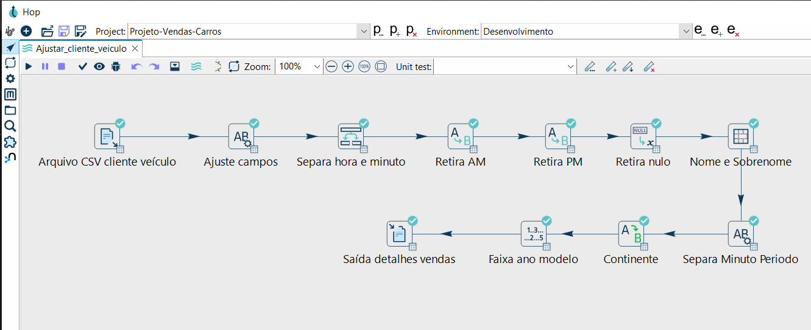

# 🚗 Projeto: Vendas de Carros com Apache Hop


Bem-vindo(a) ao nosso projeto de Engenharia de Dados focado no processamento e transformação de dados de vendas de carros utilizando a poderosa plataforma Apache Hop! 🚀

Este projeto demonstra um pipeline ETL (Extração, Transformação e Carga) construído para limpar, enriquecer e preparar dados brutos de vendas de veículos para análises futuras ou carregamento em um data warehouse.

<br>


## 🎓 Sobre o Curso

Este projeto foi desenvolvido como parte do incrível curso **"Super Academia Engenharia de Dados - 9 cursos em 1"** ministrado pelo excepcional [Grimaldo Oliveira](https://www.linkedin.com/in/grimaldo/) na plataforma [Udemy](https://www.udemy.com/). O curso oferece um mergulho profundo em diversas ferramentas e conceitos essenciais para a engenharia de dados.

<br>


## 🖥️ Ambiente de Desenvolvimento

- 💻 **Sistema Operacional**: Windows 10
- 🔄 **Ferramenta**: Apache Hop GUI (Interface Gráfica no Windows)

<br>


## 🔧 Tecnologias Utilizadas

- 🛠️ **Apache Hop**: Ferramenta de orquestração e transformação de dados (ETL).
- 📊 **CSV**: Arquivo de entrada com os dados brutos.
- 🐘 **Data Engineering Concepts**: Limpeza, padronização e enriquecimento dos dados.

<br>


## 🧠 O que o projeto faz?

O pipeline desenvolvido realiza o seguinte fluxo de tratamento dos dados:

### 📌 Etapas do pipeline

<p align="center">
   
</p>

1. **📂 Arquivo CSV cliente veículo**  
   Lê o arquivo de entrada contendo os dados dos clientes e veículos.

2. **🛠️ Ajuste campos**  
   Renomeia colunas e ajusta os tipos dos dados para os formatos corretos.

3. **🕒 Separa hora e minuto**  
   Separa o campo de horário em dois: hora e minuto.

4. **🕵️ Retira AM**  
   Remove a parte "AM" do horário, se presente.

5. **🌙 Retira PM**  
   Remove a parte "PM" do horário, se presente.

6. **🧹 Retira nulo**  
   Elimina registros com valores nulos ou vazios que podem atrapalhar as próximas transformações.

7. **👥 Nome e Sobrenome**  
   Separa o campo de nome completo em duas colunas: nome e sobrenome.

8. **⏱️ Separa Minuto Período**  
   Classifica os minutos em faixas (ex: início, meio ou fim da hora) para análise de comportamento.

9. **🌍 Continente**  
   Adiciona o continente do cliente com base em sua localidade.

10. **📅 Faixa ano modelo**  
    Agrupa os veículos em faixas de ano/modelo (ex: antes de 2000, entre 2000 e 2010, etc).

11. **📤 Saída detalhes vendas**  
    Gera o arquivo final com os dados transformados e prontos para análise.

<br>


## 📁 Estrutura de Pastas

```bash
project-apache-hop-car-sales/
├── assets/
│ └── pipeline_completo.png # Imagem do pipeline
├── data/
│ ├── input/ # Arquivos CSV de entrada
│ │ └── clientes_veiculos.csv
│ └── output/ # Arquivos CSV de saída
│ └── detalhes_vendas.csv
├── pipelines/
│ └── Ajustar_cliente_veiculo.hpl # O arquivo do pipeline Hop
├── README.md # Este arquivo que você está lendo                           
```

<br>


## 📘 Curso de Origem

📚 Este projeto foi desenvolvido como atividade prática do curso:

**Super Academia Engenharia de Dados - 9 cursos em 1**  
👨‍🏫 Professor: [Grimaldo Oliveira](https://www.linkedin.com/in/grimaldo/)  
📌 Plataforma: [Udemy](https://www.udemy.com/)

<br>


## 🚀 Como Executar

1. Clone o repositório:
   ```bash
   git clone https://github.com/MarcosWinther/project-apache-hop-car-sales.git
   ```
2. Abra o Apache Hop e carregue o pipeline `Ajustar_cliente_veiculo.hpl` localizado na pasta `pipelines/`.
3. Execute o pipeline completo.
4. Verifique a saída transformada na pasta `output/`.

<br>


## 💬 Considerações Finais

Este projeto mostra como o Apache Hop pode ser uma ferramenta poderosa para aplicar processos ETL em dados de forma visual e eficiente. Além disso, proporciona uma base sólida para a construção de pipelines mais complexos em ambientes reais de engenharia de dados.

<br>


## 👨‍💻 Expert

<p>
    
    <p>&nbsp&nbsp&nbspMarcos Winther<br>
    &nbsp&nbsp&nbsp
    <a href="https://github.com/MarcosWinther">
    GitHub</a>&nbsp;|&nbsp;
    <a href="https://www.linkedin.com/in/marcoswinthersilva/">LinkedIn</a>
    </p>
</p>
<br/><br/>

---

⌨️ com 💜 por [Marcos Winther](https://github.com/MarcosWinther)